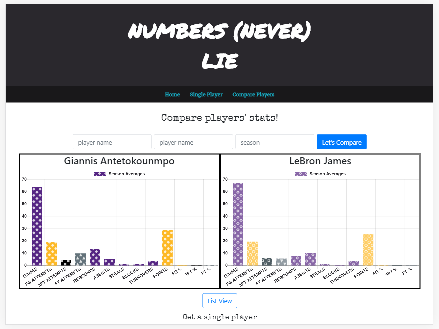

# Lets Argue(NBA) :basketball:
A.K.A 'Numbers Never Lie'. Compare NBA players' stats throughout seasons, argue with friends about it!

*This is a project I made during the 'bubble-season' of the NBA. I wanted to mainly practice my class component React skills, as well as make something useful for bettors, or people who just like to have a quick stats lookup.*

## Deployed at:
https://lets-argue-nba.vercel.app/

## Features:
* Users have ability to search for individual players by season, and receive a list or graph view of stats for that player.
* Users have ability to search for two players by season, and receive a list or graph views of stats for both players to compare.
* Access stats for NBA players from 1979 to current season.
* Stats from regular seasons, updated approximately every 10 minutes.

## Built With:
### *ReactJS, Styled Components*
* Graphs from (https://www.npmjs.com/package/react-chartjs-2)
* Patterns from (https://www.npmjs.com/package/patternomaly)
* Toasts from (https://fkhadra.github.io/react-toastify/introduction/)
* Matrix FX (https://github.com/MehmetKaplan/matrix-card)
* API from (https://ball-dont-lie.herokuapp.com)

## For Dev's: 
`npm install` to download dependencies

`npm start` Runs the app in development mode. Opens http://localhost:3000 to view in the browser.

### Contributing 
When contributing to this repository, please first discuss the change you wish to make via issue, email, or any other method with the owners of this repository before making a change.

### Issue/Bug Request
If you are having an issue with the existing project code, please submit a bug report under the following guidelines:

Check first to see if your issue has already been reported.
Check to see if the issue has recently been fixed by attempting to reproduce the issue using the latest master branch in the repository.
Create a live example of the problem.
Submit a detailed bug report including your environment & browser, steps to reproduce the issue, actual and expected outcomes, where you believe the issue is originating from, and any potential solutions you have considered.

### Feature Requests
If you have any feature ideas or requests to help improve this app, please feel free to send them with as much detail as possible.

### Pull Requests
If you have developed a patch, bug fix, or new feature that would improve this app, please submit a pull request. This isn't a huge project as of now, so submit PR's as you see fit!

Remember that this project is licensed under the MIT license, and by submitting a pull request, you agree that your work will be, too.

### Pull Request Guidelines
Ensure any install or build dependencies are removed before the end of the layer when doing a build.
Ensure that your code conforms to our existing code conventions and test coverage.
Include the relevant issue number, if applicable.

#### In progress features:
  * Stats by team
  * Stats by game
